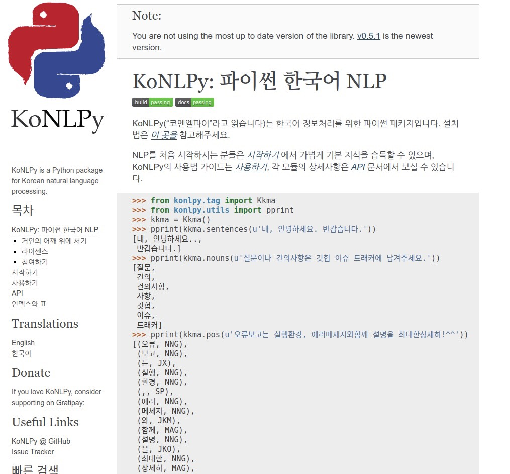
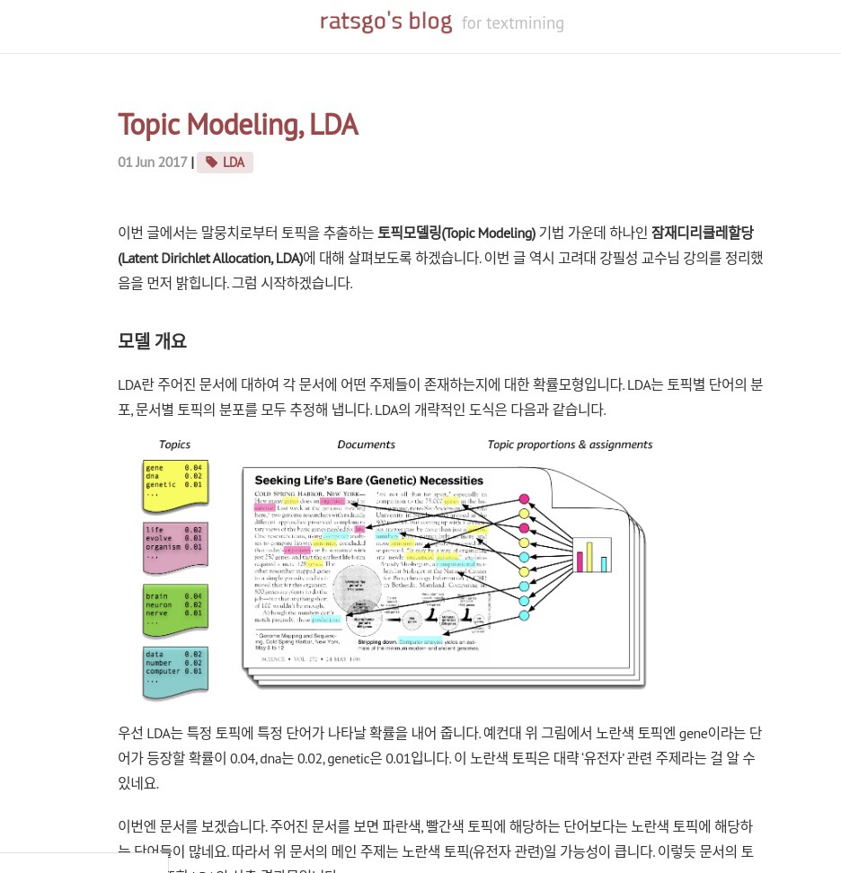
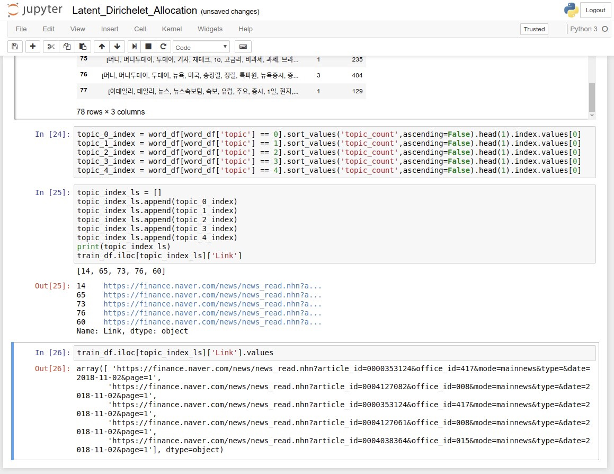

## Personal Project : News Text Mining project
- 매일매일 분수처럼 쏟아지는 뉴스 기사들을 알고리즘 기반의 추천 시스템으로 5개를 링크를 뽑아줍니다.
- It recommends five URLs from the massive news articles pouring like a fountain every day with an algorithm-based recommendation system.

### Name
- '김 현식' ('Derrick Kim')

## 1. Objective
- 알고리즘 기반으로 금융,경제 토픽의 뉴스 5개를 추천해주는데, 해당 뉴스들은 전체 뉴스의 토픽을 대변하고 있어야 한다.
- Based on the algorithm, we recommend five news articles on financial and economic topics, which should represent the whole news topic.

## 2. Dataset Description
- 네이버 금융 :https://finance.naver.com/news/mainnews.nhn?&page=1
- 네이버 경제 :https://news.naver.com/main/hotissue/sectionList.nhn?mid=hot&sid1=101&cid=996387&page=1
- 다음 금융 :http://finance.daum.net/news/news_list.daum?type=main&section=&limit=30&page=1
- 다음 경제 :https://media.daum.net/economic/#page=1

- 위의 4개의 링크에서 기사들의 '제목' 과 '링크'를 크롤링해온 후에, 알고리즘을 시행한다.
- After crawling the 'headline' and 'link' of the articles from the above four links, we run the algorithm.

## 3. Algorithm
- Korean corpus Extraction :
  - [Konlpy](https://konlpy-ko.readthedocs.io/)
  

- Recommendation algorithm:
  - [Latent Dirichlet Allocation](https://en.wikipedia.org/wiki/Latent_Dirichlet_allocation)
  - personal refered doc :   https://ratsgo.github.io/from%20frequency%20to%20semantics/2017/06/01/LDA/

  
## Sequence
> 개인 로컬의 환경 상, 코퍼스 추출은 윈도우 환경에서, 크롤링 환경은 리눅스 환경에서 진행하였다.
In the personal local environment, the corpus extraction was performed in the window environment, and the crawling environment was performed in the Linux environment.

> Newly updated : 최근 업데이트된 내용상, 파일 명은 win10 을 유지했지만, 리눅스 환경 내에서 일관되게 돌아가도록 하였다. 즉, 같은 OS 환경 내에서도 operating 가능하다.

  - **Crawling**
      + [crwaling_selenium](news_text_mining_project/process_1_linux.ipynb)
        - crawling process under the package named 'Selenium'

  - **Extract_text**
      + [extract_konlpy](news_text_mining_project/process_2_win10.ipynb)
        - extract process under the package named 'konlpy'

      + [operating_session](news_text_mining_project/process_2_operating_session.ipynb)
        - extract process under the package named 'konlpy'

  - **Tuning and Recommendation**
      + [Latent_Dirichelet_Allocation](news_text_mining_project/Latent_Dirichelet_Allocation.ipynb)
        - tuning and recommending the news with python code and LDA

        - 
        
## 4. Sequence
- process_1(Linux_env) :
  - Data crawling(under the `Selenium`)
  - [Selenium](https://www.seleniumhq.org/)

- process_2(Windows10_env)
  - Data Tuning(under the `Konlpy`)
