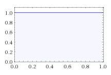
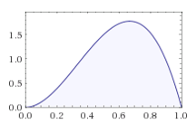
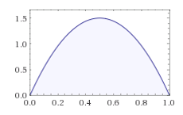
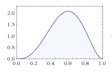
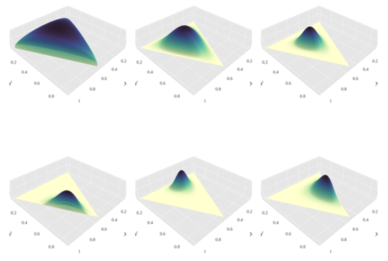
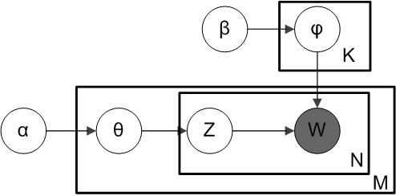
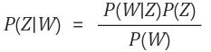

- References : https://bab2min.tistory.com/567?category=673750
- 개인 공부 자료로, 위의 링크에서 대부분의 내용과 이미지를 참고하였습니다

# LDA
- Topic modeling
- 적당한 크기의 문헌들을 넣어주면 거기에서 적절하게 컴퓨터가 연관된 단어들을 묶어서 주제 분포를 만들어주고, 문헌 별로 주제가 얼만큼 포함되었는지 계산해준다.
- Bayesian inference
- Dirichlet distribution
- Gibbs sampling

## Bayesian process
- p(theta|X) = (p(X|theta) * p(theta)) / p(X)
    - posterior probability : p(theta|X)
        - 실제 관측된 사건을 가지고 해당 사건이 일어날 확률을 더 정확하게 계산한 것, 즉 사건의 분포를 가지고 모수를 추정한다.
    - likelihood : p(theta)
        - 사건이 발생한 것
    - prior probability : p(X|theta)
        - 관측에 의거하지 않고 가정하는 특정 사건이 일어날 확률. 즉, 이러한 모수를 가지고 있으니 이러한 분포를 가진 시행이 이뤄질 것이다~ 의 문맥이다.
- posterior probability ∝ likelihood ×  prior
probability -- 여기서 분모는 omitting !

### 왜 Bayesian 을 쓸까?
- 모수를 추정하는 방법에는 maximum likelihood estimation(MLE) 방법과 maximum a posterior(MAP) 방법을 쓴다. 둘 간의 차이가 무엇일까?! MLE 방법과 MAP 방법은 모두 log likelihood 방법을 통해서, 우도를 maximizing 하는 parameter를 찾는다는 점에서 동일하지만, `추가적인 정보를 update할 수 있는가?!` 라는 이슈에 대해서 나뉘어 지게 된다.
- 즉, bayesian process 는 newly updated information 에 대해 계속적으로 update 해주면서, 보다 정확한 posterior probability 를 계산할 수 있게 하는 것이다.
    - 물론 observed data(N)이 높아질 수록 MLE 와 MAP 값은 같아지게끔 수렴한다.

## 동전 예시를 통해서 보다 자세히 알아보자
- 동전이 있고 coin toss 를 통한 결과값을 알아보고자 한다. 한 번 던져 보자

- 던지기 전,
    - 사전 확률 : 아무도 모른다. 일단 확률의 range는 [0,1] 값을 가지고, 이 값들 중에 어떠한 값들도 가질 수 있기 때문에, uniform distribution을 따른다.
    - 추가적인 관측 : `3번 중, 2번 앞면이 나왔다!`
    - 사후 확률 : 해당 정보를 update해서 사후적으로 보다 정확한 값을 가진다.

  

- 위의 사진은 처음의 사전 확률 분포를 시각화한 것으로 x 축의 [0,1] range 에 대해서 같은 likelihood 를 보여주고 있다. 즉, uniform distribution을 보여주고 있다.
- Prior ( p ) =1 (0<=p<=1)

- 이제 추가적인 관측을 포함해서 사후 확률 분포를 만들어준다.(update)
- coin toss 는 binomial distribution 을 따르고 수식적으로는 아래와 같다.
- combination(n,e) * p^e(1-p)^(n-e)
- 3p^2(1-p) ( In this case)

- 2번 이미지와 3번 이미지가 같은 분포를 띄는 이유는, 위에서 언급했던 것과 마찬가지로, 사후 확률은 사전 확률과 가능도의 곱에 비례하기 때문이다. 우리는 uniform distribution의 사전 확률 분포를 가지고 있기 때문에, 해당 케이스에서는 가능도 분포와 사후 확률 분포가 같은 형태를 띄게 된다.

- 한 번 더 시도해보자. 2번을 던졌는데 1번의 앞면이 나왔다.
- 새로운 posterior probability는 이번에도 똑같이 prior prob * likelihood 이다.
- likelihood dist 는 2p(1-p) 의 형태를 띌 것이다.

  
- 여기에 아까 update 한 분포를 곱해주면, 아래의 그래프를 가지게 된다. 쉽게 말해서 시행이 계속될 수록, 사후 확률 분포가 계속해서 update 됨을 알 수 있다.

  

- 더 많은 관측을 할 수록, 그래프의 첨도는 높아지고, 특정 확률 부분으로 집중하게 될 것이다.

__________________________________

## 켤레 사전 분포

- 위의 동전 사례에서 우리는 update되는 시행에 대해서 사전 확률 분포와 우도 분포를 곱해줌으로써, posterior distribution을 update해주었다.
- binomial distribution 이 아닌, 정규 분포만 되어도 굉장히 복잡해질 것이다.
- 다행히 똑똑한 누군가가 돌파구를 마련해주었다!
- 특정 관측 사건에 대해서 어떤 사전 확률 분포를 쓰면 계산이 매우 간편해진다는 사실을 발견하였다.
- 특정 사건과 짝을 이루는 사전 확률 분포를 `켤레 사전 분포 (Conjugate Prior)` 라고 부른다.

- Number of enable event:
    - 2 (Bernoulli or Binomial)
    - Then use Beta distribution
- Number of enable event:
    - more than 2 (Categorical or Multinomial)
    - Then use Dirichlet distribution

## Dirichlet Distribution
- 그 전에 다양한 확률 분포(probability distribution)을 다루고 가자
    - Bernoulli distribution
        - 동전을 한 번 던진다!
    - Binomial distribution
        - 동전을 여러 번 던진다!
    - Categorical distribution
        - 주사위를 한 번 던진다!
    - Multinomial distribution
        - 주사위를 여러 번 던진다!
- Beta distribution 은 Case(K) 가 2번인 경우를 의미하였다.
- Dirichlet 은 Case(K) 가 2번 이상인 경우에 사용된다.
- Beta 의 경우 k 가 2개 이기 때문에, parameter 가 2개였다.
- 그에 따라, Dirichlet 분포는 parameter가 k(>2) 개가 된다.
- 시행이 계속 추가되면서, 가능도분포(likelihood distribution) 과 사전 확률 분포(prior distribution) 의 곱에 따른 posterior distribution의 update는 beta distribution 의 경우와 같다.

  

__________________________________
## 여태까지 다룬 Diriclet dist를 Topic modeling에 적용해보자

- 대전제
    - 문헌은 여러 개의 주제를 포함할 수 있다.
    - 주제에는 여러 개의 단어가 포함될 수 있다.
    - 문헌에 사용된 단어 하나하나는 어떤 주제에 포함된다.
- 의사 알고리즘
    1. 먼저 문헌에 어떤 주제들이 들어갈지를 대략적으로 생각해 놓는다.(문헌의 주제 분포 결정)
    2. 주제들 중에서 하나를 고른다. (주제 선정)
    3. 주제들에 포함된 단어들 중에서 하나를 고른다.
    4. 그 단어를 문헌에 추가한다.

- 주제가 k 개가 있다고 하면 k개의 주제 중 하나를 고르는 행위는 multinomial 의 문제이다.
- 주제에 포함된 단어가 v개 있다고 할 때 v개의 단어 중 하나를 고르는 행위 역시 multinomial 의 이슈이다.
- 의사 알고리즘에서 알 수 있다시피, 우리는 총체적으로는 `두 번의 multinomial operation`을 실시하게 된다. 이에 따라서, 사전 확률은 켤레 사전 분포인 디리클레 분포로 설정하게 된다. (주제 분포, 단어 분포)

  
  - 위의 사진은 Plate Notation 으로, 알고리즘을 이해하는 데에 도움을 줄 수 있다.
- M : Num of Documents
- K : Num of Title
- N : Num of words in Docs
- theta : dist of title in docs
- pi : dist of word in title
- Z : the identity number of word in title

- 우리가 궁극적으로 원하는 것은?

  
  - P(Z|W)를 최대로 하는 Z값을 찾는 것이 LDA의 목표
-즉, 단어가 있을 때, 이 단어의 주제를 가장 잘 indentify 하게 하는 Z를 찾는 것이다.

## Gibbs Sampling 적용하기
[8번 이미지]
위의 이미지에서 분모 P(W)를 보게 되면, 이는 알 수 있다시피, Word 의 distribution이다. 근데, 실제 문서에는 단어들이 100개를 넘어가는 경우가 허다하다. 이런 경우, 확률을 계산하는 일이 기하급수적으로 복잡해지기 때문에, Gibbs sampling 기법을 사용하게 된다.
- N차 벡터에 대한 확률을 계산하는 것은 복잡하기 때문에, 1차 자료가 N 개 있다고 가정하고 1차 자료를 계산할 때, 나머지 차원의 자료를 고정한 후에, 전부 계산하고 합치면 같게 되는 개념이다.
[9번 이미지]
- 위의 사진과 같이 수렴하게 되는데, 우항을 집중해서 보자
- 왼쪽은 특정 단어 m이 j라는 주제에 속하게 될 ratio 즉, 확률을 의미
- 오른쪽은 특정 문헌 d 에 속한 단어들이 주제 j 에 속할 ratio 즉, 확률을 의미한다.
- 이 두 비중을 곱하면 우리가 궁극적으로 구하려는 사후 확률과 비례하게 된다는 것이다.

<추후 보강>
